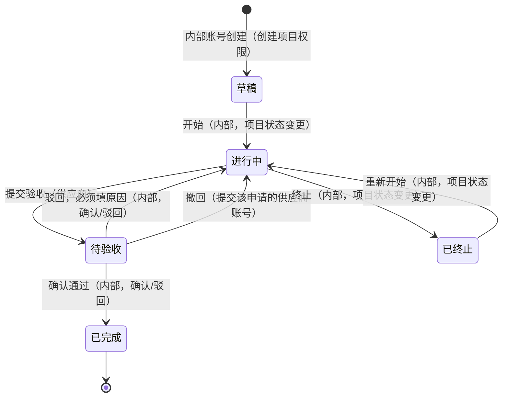

# 角色权限与交互说明（2026-09-23）

本文按**当前开发库的角色配置**和**当前代码的实际校验**整理每类账号能做什么。

- 角色配置来源：开发库 `yf_system_dev_20260923_011050`，2026-09-23 20:50（UTC-07:00）重新查询；已应用权限迁移 `20260924025646_AddDictionaryAndOwnerTransferPermissions`。
- 规则来源：`server_dotnet/Yf.Api` 当前代码，以及 [主项目与子项目协作契约](../server_dotnet/docs/主项目与子项目协作契约-2026-09-16.md)、[Robot 料号与创建人负责制](../server_dotnet/docs/Robot料号与创建人负责制-2026-09-23.md)、[项目负责人转交与数据字典权限](../server_dotnet/docs/项目负责人转交与数据字典权限-2026-09-23.md)、[项目复制与引用履历契约](../server_dotnet/docs/项目复制与引用履历契约-2026-09-15.md)。负责人、访问范围和字典权限以转交契约为准。
- 本文角色配置是本开发库的查询快照，不代表所有部署环境的默认角色。角色配置调整后，第 1、3～6、8 节需要同步更新；第 2 节描述当前代码规则。

---

## 1. 当前配置的使用结论

### 普通用户可以创建项目，也可以接手项目

1. 内部账号有"项目列表"权限时，可以看到**自己担任负责人或自己创建的主项目及其子项目**；有"查看全部项目"可以看到全部。
2. 普通用户当前已有"创建项目"权限。新建主项目后自动成为负责人，也可由 admin 或课级主管通过"变更负责人"将已有主项目交给该用户。
3. 转交后，主项目创建人仍保留访问权；原负责人如果不是创建人且没有"查看全部项目"权限，则失去访问权。

普通用户在自己可见的项目中，可以按状态执行上传、下载、预览、留言、项目状态变更和确认/驳回。没有创建或接手任何项目时列表可以为空，这不表示权限失效。

### 课级主管可以新建和重新启用供应商账号

- 非系统管理员分配供应商账号角色时，仍受权限上限约束；仅供应商专属的"提交项目验收"和"撤回项目验收"不计入比较，其余权限必须由操作人持有。
- 当前"课级主管"拥有"供应商账号管理"及"供应商权限"角色中其余所需权限，因此可新建账号、分配该角色并重新启用账号。
- 供应商角色必须启用，且只能包含供应商可用的 8 项权限；不是任意角色都可分配。

### 其他需要知道的

- **admin 和课级主管均可维护 Robot 料号。** 创建主项目必须选择该供应商下启用的料号；维护使用独立的"数据字典管理"权限，不要求"系统参数管理"。
- **课级主管之间可以互相管理。** 当前角色权限相同，可按权限上限管理对方账号，也可创建新的课级主管；停用、调岗和删除仍受项目负责人、历史记录及禁止自操作等校验约束。

---

## 2. 基本规则（代码写死，不随角色配置变化）

### 2.1 账号类型优先于角色

系统先看账号是**公司内部**还是**供应商**，再看角色里有没有勾权限。以下限制与角色无关：

| 操作 | 谁能做 | 说明 |
|---|---|---|
| 提交验收、撤回验收 | 只有供应商账号 | 内部账号勾了也会被拒绝 |
| 确认验收、驳回验收 | 只有内部账号 | 供应商账号勾了也会被拒绝 |
| 删除文件、删除留言 | 只有内部账号 | 供应商账号勾了也会被拒绝 |
| 创建/编辑/删除项目、改项目状态、复制项目、变更负责人 | 只有内部账号 | 仍需对应权限和项目访问权 |
| 用户、供应商、组织、角色、日志、系统参数等后台管理 | 只有内部账号 | |

- 供应商账号的角色**只能**包含以下 8 项：工作台、项目列表、上传文件、下载文件、预览文件、发表留言、提交项目验收、撤回项目验收。多一项，这个角色就不能分配给供应商账号。
- 内部账号只能绑定一个角色。供应商账号的角色在创建后不能更换。

### 2.2 谁能看到哪些项目

| 账号 | 能看到的项目 |
|---|---|
| 供应商账号 | 自己公司（供应商）下的**全部**主项目和子项目，包括草稿。同一供应商的所有启用账号看到的一样 |
| 内部账号，有"查看全部项目" | 全部项目 |
| 内部账号，没有"查看全部项目" | **自己是负责人或主项目创建人**的主项目及其全部子项目 |

- 前提是必须有"项目列表"权限。
- 负责人规则：新建主项目时，负责人自动设为创建人，创建表单不能指定；之后可通过专用的"变更负责人"操作转交。编辑项目资料不转交负责人。
- 转交需要内部账号具有"项目列表"、"变更项目负责人"权限，并能访问该主项目。新负责人必须是启用且通过启用角色拥有"项目列表"权限的内部账号，不能与当前负责人相同。
- 存在待验收子项目时不能转交。其他状态（包括已完成、已终止）允许转交；负责人和有效直属课别同步到全部子项目，没有有效课别时置空，其余已完成业务资料保持验收快照。
- 主项目创建人转交后仍能访问；仅创建某个子项目不额外授予主项目访问权。
- 所有项目操作（上传、留言、验收、改状态等）都只能在自己看得到的项目里进行。
- 供应商被停用后，该供应商的所有账号都看不到项目，也无法登录后使用。

### 2.3 系统管理员不受"不超过自己权限"的限制

admin 所在的"系统管理员"是内置角色，拥有当前全部 37 项权限。分配角色、分配权限、管理账号时，不受"只能授予不超过自己的权限"的限制。系统至少要保留一个启用的管理员，自己也不能移除自己的管理员角色。

---

## 3. 当前角色一览

| 角色 | 账号类型 | 权限数 | 已绑定用户 |
|---|---|---:|---:|
| 系统管理员（内置） | 内部 | 37（全部） | 1（admin） |
| 课级主管 | 内部 | 30 | 0 |
| 普通用户 | 内部 | 9 | 0 |
| 供应商权限 | 供应商 | 8 | 0 |

### 权限对照表

✅ = 已分配，仍须满足账号类型、项目范围和状态要求；⚠️ = 已分配但账号类型不允许使用；空白 = 未分配。

| 分类 | 权限 | 系统管理员 | 课级主管 | 普通用户 | 供应商权限 |
|---|---|:-:|:-:|:-:|:-:|
| 菜单 | 工作台 | ✅ | ✅ | ✅ | ✅ |
| 项目 | 项目列表 | ✅ | ✅ | ✅ | ✅ |
| 项目 | 查看全部项目 | ✅ | ✅ | | |
| 项目 | 创建项目 | ✅ | ✅ | ✅ | |
| 项目 | 编辑项目 | ✅ | ✅ | | |
| 项目 | 删除项目 | ✅ | ✅ | | |
| 项目 | 项目状态变更 | ✅ | ✅ | ✅ | |
| 项目 | 确认/驳回项目 | ✅ | ✅ | ✅ | |
| 项目 | 变更项目负责人 | ✅ | ✅ | | |
| 项目 | 提交项目验收 | ⚠️ | | | ✅ |
| 项目 | 撤回项目验收 | ⚠️ | | | ✅ |
| 文件 | 上传文件 | ✅ | ✅ | ✅ | ✅ |
| 文件 | 下载文件 | ✅ | ✅ | ✅ | ✅ |
| 文件 | 预览文件 | ✅ | ✅ | ✅ | ✅ |
| 文件 | 删除文件 | ✅ | ✅ | | |
| 留言 | 发表留言 | ✅ | ✅ | ✅ | ✅ |
| 留言 | 删除留言 | ✅ | ✅ | | |
| 供应商 | 供应商管理（菜单） | ✅ | ✅ | | |
| 供应商 | 供应商管理（新增/编辑/停用） | ✅ | ✅ | | |
| 供应商 | 删除供应商 | ✅ | ✅ | | |
| 供应商 | 供应商账号管理 | ✅ | ✅ | | |
| 供应商 | 删除供应商账号 | ✅ | ✅ | | |
| 用户 | 用户管理（菜单） | ✅ | ✅ | | |
| 用户 | 用户管理（新增/编辑/停用/重置密码/换角色） | ✅ | ✅ | | |
| 用户 | 删除用户 | ✅ | ✅ | | |
| 组织 | 组织架构（菜单） | ✅ | ✅ | | |
| 组织 | 组织架构管理 | ✅ | ✅ | | |
| 组织 | 删除组织节点 | ✅ | ✅ | | |
| 角色 | 角色权限（菜单） | ✅ | | | |
| 角色 | 角色管理 | ✅ | | | |
| 角色 | 删除角色 | ✅ | | | |
| 日志 | 操作日志（菜单） | ✅ | ✅ | | |
| 日志 | 日志查看 | ✅ | ✅ | | |
| 系统 | 系统参数（菜单） | ✅ | | | |
| 系统 | 系统参数管理 | ✅ | | | |
| 字典 | 数据字典（菜单） | ✅ | ✅ | | |
| 字典 | 数据字典管理 | ✅ | ✅ | | |

内部账号不能提交/撤回验收，即使系统管理员角色包含这两项权限也会被拒绝。普通用户没有查看全部项目权限，仅能操作自己负责或自己创建的主项目及其子项目。

---

## 4. 各角色能做什么

### 4.1 系统管理员（admin）

在内部账号允许的范围内拥有全部权限；按当前配置，以下功能仅系统管理员拥有：

- **角色权限**：新建、编辑、停用、删除角色，给角色分配权限。
- **系统参数**：维护系统参数、邮件发送（SMTP）设置、邮件提醒规则（总开关、按收件对象、按消息类型）。

数据字典维护、供应商账号管理和负责人转交均可由 admin 或课级主管执行。项目方面两者都能看全部项目、能验收，但都不能提交或撤回验收。

### 4.2 课级主管

**项目协作**（能看到全部项目）：

- 创建主项目（同时至少建一个子项目），自己成为负责人。
- 在主项目下新增子项目；复制子项目（复制到同一主项目下，只复制文件）。
- 编辑主项目公共资料、编辑子项目名称和说明。
- 变更主项目负责人（没有待验收子项目时），可交给启用且具有项目列表权限的内部账号，包括普通用户。
- 开始、终止、重新开始子项目。
- 确认或驳回供应商的验收申请。
- 上传、下载、预览、批量下载文件；删除文件。
- 发表留言（可带图片）；删除任何人的留言。
- 删除符合条件的子项目和主项目（条件见第 5.3 节）。

**后台管理**：

- **供应商**：新增、编辑、停用、删除供应商。
- **供应商账号**：新建、编辑姓名和邮箱、重置密码、停用、重新启用、删除；创建和启用时校验供应商角色及授权上限，删除仍受历史记录限制。
- **数据字典**：维护优先级字典和 Robot 料号目录。
- **内部用户**：新建、编辑、停用、重置密码、更换角色、删除。只能分配"课级主管"或"普通用户"角色，不能管理 admin。
- **组织架构**：新增、编辑、停用、删除 事业部 > 部门 > 课别 节点。
- **操作日志**：查看全系统所有人的操作记录。

**不能做**：角色权限管理、系统参数和 SMTP 设置、提交或撤回验收。

### 4.3 普通用户

**按当前配置**：可创建主项目并成为负责人，也可接手由 admin 或课级主管转交的项目。只看得到自己负责或自己创建的主项目及其子项目，在这些项目中可以：

- 创建主项目；在允许的主项目状态下新增子项目、复制子项目。
- 上传、下载、预览文件（不能删除文件）。
- 发表留言（不能删除留言）。
- 开始、终止、重新开始子项目。
- 确认或驳回验收。

不能编辑项目资料、删除项目或变更负责人，也不能进入后台管理页面。创建项目所需的供应商、料号和优先级需由 admin 或课级主管提前维护。

### 4.4 供应商账号（供应商权限角色）

能看到自己公司（供应商）的全部项目，在这些项目里可以：

- 查看主项目、子项目详情，以及项目动态。
- 上传、下载、预览、批量下载文件（上传只能在"进行中"）。
- 发表留言（可带图片），查看已读情况。
- **提交验收**：子项目在"进行中"、至少有一个可用文件、没有正在上传的文件、项目有可用的验收人。
- **撤回验收**：只能撤回**自己提交的**、还在"待验收"的申请。

**不能做**：删除文件、删除留言、创建或编辑项目、改项目状态、确认或驳回验收、任何后台管理、查看操作日志。

### 4.5 所有账号都能做的

- 登录，修改自己的密码和个人资料。首次登录或被重置密码后必须先改密码。
- 错误密码统一返回登录失败，不按失败次数锁定账号；服务端仍按来源 IP 和账号做短时请求限流。
- 查看协作通知（新留言、新文件、验收结果等）并标记为已查看。

---

## 5. 项目流程

### 5.1 子项目状态流转

- "待验收"时不能终止，要先驳回或等供应商撤回。
- 有文件正在上传时，不能终止，也不能提交验收。
- 主项目的状态由子项目自动算出：全部是草稿则为草稿；有任何一个开始了则为进行中；全部完成则为已完成；全部结束且至少一个终止则为已终止。
- **谁是验收人**：启用的内部账号，同时有"项目列表"和"确认/驳回项目"，并且是当前负责人、主项目创建人或具有"查看全部项目"权限。按当前配置，admin 和启用的课级主管可验收全部项目；普通用户可验收自己负责或自己创建的主项目下的子项目。一个项目没有任何可用验收人时，供应商提交会被拒绝。

### 5.2 各状态下能做什么

| 操作 | 草稿 | 进行中 | 待验收 | 已完成 | 已终止 |
|---|:-:|:-:|:-:|:-:|:-:|
| 上传文件 | | ✅ | | | |
| 删除文件（内部） | | ✅ | | | |
| 下载/预览文件 | ✅ | ✅ | ✅ | ✅ | ✅ |
| 发表留言 | ✅ | ✅ | ✅ | | |
| 删除留言（内部） | ✅ | ✅ | ✅ | | |
| 编辑子项目名称/说明（内部） | ✅ | ✅ | | | |
| 删除子项目（内部，另有条件） | ✅ | | | | ✅ |

主项目层面：

- 有子项目在"待验收"时，不能编辑主项目公共资料。
- 主项目"已完成"或"已终止"后，不能编辑、不能新增子项目、不能复制子项目。
- 主项目的供应商创建后不能更换。负责人可通过"变更负责人"专用操作更换；存在待验收子项目时禁止转交，其他状态允许，已完成和已终止也不例外。

### 5.3 删除的前提条件

| 删除对象 | 条件 |
|---|---|
| 子项目 | 处于草稿或已终止；**从未有过**文件、留言和上传记录（文件删了也算有过）；没有复制履历，也没有进行中的复制任务 |
| 主项目 | 下面已经没有子项目（要先逐个删除子项目） |
| 文件 | 内部账号，项目在进行中。删除后文件标记为已删除，不再显示 |
| 留言 | 内部账号，项目未完成也未终止。留言里的图片保留 30 天后自动清理 |
| 供应商 | 没有关联项目、没有 Robot 料号、没有账号 |
| 内部用户 | 不能删自己和受保护的系统管理员；仍被项目归属或业务历史引用时不能删。仍负责未结束主项目时也不能停用，需先完成交接 |
| 组织节点 | 没有下级节点、没有用户 |
| 角色 | 不是内置角色，并且没有绑定用户 |

实际使用中，项目一旦开始协作就基本删不掉，只能在满足状态条件后"终止"。账号有了业务记录后通常只能停用；仍负责未结束主项目时，须先转交负责人。

---

## 6. 一次完整协作的典型过程

| 步骤 | 谁来做 | 做什么 |
|---|---|---|
| 1 | admin 或课级主管 | 新增供应商、维护该供应商的 Robot 料号、新建供应商账号（分配"供应商权限"角色） |
| 2 | admin 或课级主管 | 新建内部用户，分配"课级主管"或"普通用户"角色 |
| 3 | admin、课级主管或普通用户 | 创建主项目（选供应商、料号、工令号等）和子项目，自己成为负责人 |
| 3' | admin 或课级主管（需要交接时） | 在没有待验收子项目时变更主项目负责人；全部子项目同步归属，主项目创建人保留访问权 |
| 4 | 能访问项目的内部账号，具有项目状态变更权限 | 开始子项目（草稿 → 进行中） |
| 5 | 双方 | 上传文件、留言沟通；上传方向自动区分：内部上传为"公司→供应商"，供应商上传为"供应商→公司" |
| 6 | 供应商账号 | 提交验收（进行中 → 待验收） |
| 7 | 该项目的可用验收人（见第 5.1 节） | 确认通过（→ 已完成），或填原因驳回（→ 进行中，回到第 5 步） |
| 7' | 提交验收的供应商账号 | 在确认之前撤回（→ 进行中） |
| 8 | 系统 | 全部子项目完成后，主项目自动变为已完成 |

---

## 7. 邮件提醒（在系统参数里可按类型和收件对象开关）

| 事件 | 发给谁 |
|---|---|
| 新留言 | 对方一侧：内部发的发给该供应商的所有启用账号；供应商发的发给项目负责人 |
| 新文件 | 同上（上传人本人不收） |
| 提交验收 | 该项目的所有验收人 |
| 确认通过 / 驳回 | 提交这次验收的供应商账号 |
| 撤回验收 | 公司一侧（项目负责人）；同时作废之前发给验收人的待验收提醒 |

只有账号是启用状态、填了邮箱、仍能看到该项目，并且 SMTP 已配置时，才会真正发出邮件。

主项目创建人和全局查看人不会仅因可见而收到新留言、新文件邮件；内部收件人仍是当前负责人。提交验收的提醒则发给全部可用验收人。

---

## 8. 配置维护与待决定事项

- 普通用户已具备创建项目权限；课级主管已具备供应商账号开通、数据字典维护和负责人转交能力，这些不再是待实现事项。
- 当前仍待业务确认：是否接受课级主管之间在权限上限和业务约束内互相管理账号。
- 后续调整角色时，应同步更新本开发库配置快照、权限对照表和协作流程；其他环境需单独核对实际授权。
